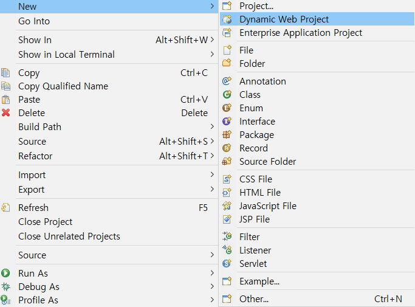

# Servlet & JSP

분류: Java
날짜: 2024년 1월 18일

# ✅ Tomcat

<aside>
💡 **Apache Tomcat**
오픈 소스 웹 서버 및 Servlet 컨테이너
Servlet 컨테이너로서 동작하고 Servlet, JSP 등을 지원하며 이를 활용한 웹 애플리케이션 구성에 있어서 필수 요소 및 편의 기능을 제공한다.

</aside>

## Tomcat 설치

[Apache Tomcat® - Apache Tomcat 9 Software Downloads](https://tomcat.apache.org/download-90.cgi)

- 설치 파일 다운로드 후 사용할 Java workspace 폴더에 Tomcat을 설치하여 적용한다.



- Dynamic Web Project를 선택


- New Runtime 선택


- tomcat 검색해 설치한 Tomcat 버전 선택 후 Finish

## WS & WAS

- WS와 WAS는 웹 애플리케이션의 주요 용어
    
    <aside>
    💡 **WS(Web Server)**
    주로 **정적**인 컨텐츠 제공에 중점을 둔 서버.
    변수나 요청에 따라 변하지 않고 고정된 데이터를 제공함.
    HTML 파일, 이미지, CSS 등이 제공 컨텐츠의 예시
    
    </aside>
    
    <aside>
    💡 **WAS(Web Application Server)**
    주로 **동적**인 컨텐츠 제공에 중점을 둔 서버.
    Servlet, JSP 등으로 구현, 실행됨.
    데이터베이스와의 상호작용, 업무 로직 처리 등을 담당.
    
    </aside>
    
    **→ Tomcat 또한 대표적인 WAS 중 하나**
    

# ✅ Servlet & JSP

# Servlet

- 자바로 작성된 프로그램을 웹 애플리케이션의 동적인 컴포넌트.
- 클라이언트 요청**(request)**을 처리하고 서버에서 동적인 웹 페이지를 생성하고 전달하는 역할**(response)**
- Servlet 구현 시에는 반드시 HttpServlet 클래스를 상속받아야 함. (extends HttpServlet)

](img5/Untitled%203.png)

[https://devpoong.tistory.com/44](https://devpoong.tistory.com/44)

## **Servlet 구조와 주요 메서드**

■ **Servlet:**

- **역할:** Servlet은 자바 언어로 작성된 웹 애플리케이션의 동적인 로직을 처리하기 위한 자바 클래스. 클라이언트의 HTTP 요청을 받아 동적인 콘텐츠 생성, 그에 대한 응답 제공.
- **주요 메소드:**
    - **`init()`**: Servlet의 초기화를 수행하는 메서드
    - **`service()`**: Servlet에 대한 서비스를 처리하는 메서드
    - **`destroy()`**: Servlet이 소멸되기 전에 호출되는 메서드

■ **ServletConfig:**

- **역할:** ServletConfig는 Servlet의 초기화 정보를 제공하는 인터페이스. 서블릿이 초기화될 때 Servlet Container에 의해 제공되며, Servlet의 초기화 매개변수 및 기타 설정 정보를 얻을 수 있음.
- **주요 메소드:**
    - **`getInitParameter(String name)`**: 지정된 초기화 매개변수의 값을 반환
    - **`getInitParameterNames()`**: 모든 초기화 매개변수의 이름을 반환

■ **GenericServlet:**

- **역할:** GenericServlet은 Servlet 인터페이스를 구현한 추상 클래스로, Servlet을 개발하기 위한 기본적인 구현을 제공. 직접 사용하기보다는 이 클래스를 상속받아 구체적인 Servlet을 작성하는 것이 일반적
- **주요 메소드:**
    - **`init(ServletConfig config)`**: 초기화를 수행하는 메서드로, GenericServlet에서 기본 구현 제공
    - **`service(ServletRequest req, ServletResponse res)`**: 클라이언트 요청에 대한 서비스를 처리하는 메서드로, 서블릿에서 구현해야 함.

■ **HttpServlet:**

- **역할:** HttpServlet은 GenericServlet을 상속받은 클래스로, HTTP 프로토콜에 특화된 Servlet을 개발할 때 사용. HTTP 요청 메서드(GET, POST 등)에 따라 적절한 처리를 제공하며, 주로 웹 애플리케이션에서 사용.
- **주요 메소드:**
    - **`doGet(HttpServletRequest request, HttpServletResponse response)`**: HTTP GET 요청에 대한 처리를 수행하는 메서드.
    - **`doPost(HttpServletRequest request, HttpServletResponse response)`**: HTTP POST 요청에 대한 처리를 수행하는 메서드.

# JSP

<aside>
💡 **JSP**
동적 웹페이지를 생성한다는 Servlet과 동일한 역할을 하며,
HTML 코드에 JAVA 코드를 포함해 웹페이지를 생성한다.
JSP가 실행되면 자바 Servlet으로 변환, 웹 애플리케이션 서버에 동작하며 기능을 수행하고 생성 데이터를 웹 페이지에 함께 클라이언트로 응답.

</aside>

- **동작 원리**
    - 클라이언트가 동작함으로써 hello.jsp 요청
    - JSP 컨테이너가 JSP 파일 읽음
    - JSP 컨테이너가 변환 작업을 통해 servlet(.java) 파일 생성
    - .java 파일을 다시 .class 파일로 컴파일
    - Execute(실행)으로 HTML 파일을 생성, JSP 컨테이너에 전달
    - JSP가 HTTP 프로토콜으로 HTML 페이지를 클라이언트에 전달

# Servlet과 JSP의 차이

| 작성방식 | 장점 | 단점 | 형식 |
| --- | --- | --- | --- |
| 서블릿 | 복잡한 로직 구현에 적합 | Java 코드 중심이라 화면 작성 작업과 수정이 어려움 | Java 코드 ⊃  HTML 코드 |
| JSP | HTML 코드가 중심이라 화면 작성, 수정 편리 | 소스보기로 소스가 공개돼 중요 정보에 부적합 | HTML 코드 ⊃ Java 코드 |

**둘 중 한 가지만 써서도 웹 애플리케이션을 구현할 수는 있으나 각각 장단점이 있기에 상호 보완할 수 있다.**

# ✅ MVC 패턴 구현

## ■ MVC

- Model: DTO(데이터 저장 담당 클래스), DAO(데이터 사용기능 담당 클래스)를 포함한다.
- Controller: Java 코드가 중심이 되는 Servlet을 사용하며 주로 데이터 처리 로직이 담겨있다.
- View: html이 중심이 되는 JSP를 사용하며, 사용자에게 보여주는 부분을 담당.

## 기본 개념

- html 코드에서 WebServlet으로 보내는 요청은 action=*"주소"* 형태로 전달되며,
Servlet(.java)에서 @WebServlet(”/주소”)의 형태로 받아 메서드를 실행한다.
- html 코드에서 설정한 메서드 전달 방식에 따라 데이터 전송 방식이 상이하다.
    - Get 방식: URL의 쿼리 파라미터로 데이터가 전송된다. URL에 전달한 파라미터가 그대로 노출되므로 보안에 취약하다.
    ex) https://www.google.com/**search?q=사과나무**
    - Post 방식: 메시지의 본문(body)에 데이터를 포함해 전송하며, URL에 데이터가 포함되지 않기에 Get과 반대로 길이 제한에서 자유롭다.
    ex) 로그인 정보, 파일 업로드, url에 포함되기 어려운 긴 텍스트
- **세션과 쿠키**
세션과 쿠키는 클라이언트-서버 간의 상태를 유지하고 정보를 저장하는 데에 사용되는 역할은 같지만, 여러 특징에서 차이가 있다.
    
    <aside>
    💡 **세션(Session)**
    
    - 세션 데이터는 서버에 저장됨
    - 클라이언트보다 용량이 더 크고 빠른 서버에 저장되므로 용량 제한이 거의 없음
    - 세션은 일정 시간만 유지되며 클라이언트와의 상호 작용이 없다면 만료됨(흔히 로그인 해두고 장시간 동작이 없을시 로그아웃이 되는 등)
    </aside>
    
    - 세션의 데이터 저장과 출력
        
        ```java
        **// Session 호출
        // HttpSession의 내장 객체인 session을 request에 불러온다.**
        HttpSession session = request.getSession(); // 내장객체
        session.setAttribute("key1", "세션value1");
        session.setAttribute("key2", "session value2");
        ```
        
        ```java
        **// Session에 저장한 데이터 출력**
        <% String key3 = (String) session.getAttribute("key3"); %><br>
        <%= key3 %>
        <% String key4 = (String)  session.getAttribute("key4"); %><br>
        <%= key4 %>
        ```
        
    
    ---
    
    <aside>
    💡 **쿠키(Cookie)**
    
    - 쿠키는 클라이언트의 로컬 브라우저에 저장
    - 제한된 용량을 가짐
    - 만료 기간을 설정할 수 있음
    - 쿠키는 HTTP 헤더에 포함돼 서버로 전송되며, 서버는 쿠키를 읽어 클라이언트를 식별함
    </aside>
    
    - 쿠키 데이터의 저장과 출력
        
        ```java
        **// 쿠키 객체 생성**
        Cookie msg1 = new Cookie("key1", "fisa");
        Cookie msg2 = new Cookie("key2", "쿠키");
        
        **// 쿠키 데이터 보존 기간 설정(초 단위)**
        msg1.setMaxAge(60 * 3); 
        
        **// response에 쿠키 저장**
        response.addCookie(msg1);
        response.addCookie(msg2);
        ```
        
        ```java
        **// 객체 호출 및 저장**
        Cookie [] cs = request.getCookies();  // redirect로 받았으므로 저장할 때는 response, 가져올 때는 request에서 확인 
        
        **// for문으로 key1을 key로 갖는 쿠키 호출 및 출력**
        for (Cookie c : cs) {
        	if (c.getName().equals("key1")) {
        	System.out.println(c.getValue());
        	}
        ```
        

## 실습 코드(실행 순으로)

### 간단한 로그인 화면 및 상품 구매를 구현했다.

- **로그인 기능**
    - **먼저 ID와 비밀번호를 입력 받고 id, pw라는 이름의 변수로 “/validation” 주소 Servlet에 전달한다.**
        
        ```html
        <!DOCTYPE html>
        <html>
        <head>
        <meta charset="UTF-8">
        <title>서비스 로그인</title>
        </head>
        <body>
        
        올바른 ID, 비밀번호를 입력하세요
        
        **// ID, 비밀번호를 url에 노출시키지 않기 위해 POST 방식 사용**
        <form action="validation" method="POST">
         아이디 <input type="text" name="id"> <br>
         비밀번호 <input type="text" name="pw"> <br>
         
         로그인 버튼 <input type="submit" value="로그인">
        </form>
        </body>
        </html>
        ```
        
    - **그 후 ID와 비밀번호가 일치하는지 확인한다. (LoginCheck.java)**
        
        ```java
        package controller;
        
        import java.io.IOException;
        import java.io.PrintWriter;
        
        import javax.servlet.ServletException;
        import javax.servlet.annotation.WebServlet;
        import javax.servlet.http.HttpServlet;
        import javax.servlet.http.HttpServletRequest;
        import javax.servlet.http.HttpServletResponse;
        import javax.servlet.http.HttpSession;
        
        **// html로부터 action을 전달받을 주소**
        @WebServlet("/validation")
        public class LoginCheck extends HttpServlet {
        	protected void doPost(HttpServletRequest request, HttpServletResponse response) throws ServletException, IOException {
        		process(request, response);
        		response.getWriter().append("Post");
        	}
        
        	protected void process(HttpServletRequest request, HttpServletResponse response) throws ServletException, IOException {
        
        		**// 아이디 <input type="text" name="id"> <br>**
        		String id =request.getParameter("id");
            **// 비밀번호 <input type="text" name="pw"> <br>**
        		String pw =request.getParameter("pw");
        		 
        		**// 응답에 대한 기본 설정**
        		response.setContentType("text/html;charset=utf-8");
        		PrintWriter out = response.getWriter();
        		
        		**// ID가 master이고 비밀번호가 1234인 사용자만 이동**
        		if (id.equals("master")&&pw.equals("1234")) {
        			HttpSession session = request.getSession();
        			**// 세션에 사용자 이름, ID, 비밀번호 전달 및 저장**
        			session.setAttribute("name", "최현규");
        			session.setAttribute("id", id);
        			session.setAttribute("pw", pw);
        			**//sendRedirect 메서드로 로그인 성공 화면으로 이동**
        			response.sendRedirect("Success.jsp");
        		} else {
        			**//sendRedirect 메서드로 로그인 실패 화면으로 이동**
        			response.sendRedirect("Fail.jsp");
        		}
        	}
        }
        ```
        
    - **성공 시 코드**
        
        ```html
        <%@ page language="java" contentType="text/html; charset=UTF-8"
            pageEncoding="UTF-8"%>
        <!DOCTYPE html>
        <html>
        <head>
        <meta charset="UTF-8">
        <title>로그인 성공</title>
        </head>
        <body>
        	
        	로그인에 성공했습니다. <%@ page %> <br/>
        	**// 세션에 전달했던 이름, ID, PW를 다시 getAttribute로 받아온다.**
        	<%
        	String name = (String) session.getAttribute("name");
        	String id = (String) session.getAttribute("id");
        	String pw = (String) session.getAttribute("pw");
        	
        	if (name == null) {
        		response.sendRedirect("login.html");
        	}
        	%>
        	
        	**// 변수 확인용 코드**
        	사용자 이름: <%=name %> <br/>
        	사용자 ID: <%=id %> <br/>
        	사용자 PW: <%=pw %> <br/>
        	<button onclick="location.href='Product.jsp'">구매페이지 이동</button>
        </body>
        </html>
        ```
        
    - **실패 시 코드**
        
        ```html
        <%@ page language="java" contentType="text/html; charset=UTF-8"
            pageEncoding="UTF-8"%>
        <!DOCTYPE html>
        <html>
        <head>
        <meta charset="UTF-8">
        <title>로그인 실패</title>
        </head>
        <body>
        	
        	로그인에 실패했습니다. <%@ page %> <br/>
        	**// 버튼을 통해 로그인 화면으로 다시 돌아간다.**
        	<button onclick="location.href='Login.html'">처음 화면으로 돌아가기</button>
        
        </body>
        </html>
        ```
        
    
    - **로그인 화면 및 성공/실패 화면**
        
        
        
        
        
        
        
    
- **상품 구매 및 구매 내역 확인 기능**
    - **로그인 성공 후 아래 <구매페이지 이동> 버튼을 누르면 Product.jsp로 이동한다.**
        
        ```html
        <%@ page language="java" contentType="text/html; charset=UTF-8" pageEncoding="UTF-8"%>
        <%@ page import="javax.servlet.http.HttpSession" %>
        <!DOCTYPE html>
        <html>
        <head>
            <meta charset="UTF-8">
            <title>가격 계산 페이지</title>
            <script type="text/javascript">
                function calculatePrice() {
                    var quan1 = document.getElementById("quan1").value;
                    var quan2 = document.getElementById("quan2").value;
                    var quan3 = document.getElementById("quan3").value;
        
                    var price1 = 30000;
                    var price2 = 1000;
                    var price3 = 500;
        
                    var total1 = quan1 * price1;
                    var total2 = quan2 * price2;
                    var total3 = quan3 * price3;
                    var total = total1 + total2 + total3;
        
                    document.getElementById("total1").innerHTML = total1 + "원";
                    document.getElementById("total2").innerHTML = total2 + "원";
                    document.getElementById("total3").innerHTML = total3 + "원";
                    document.getElementById("total").innerHTML = "상품 총 가격: " + total + "원";
        
                    // 상품 수량을 세션에 저장
                    var session = '<%= session %>';
                    session.setAttribute("quan1", quan1);
                    session.setAttribute("quan2", quan2);
                    session.setAttribute("quan3", quan3);
                }
            </script>
        </head>
        
        <body>
            <form action="result" method="POST">
           	<%
        	String name = (String) session.getAttribute("name");
        	
        	if (name == null) {
        		response.sendRedirect("login.html");
        	}
        	%>
        	
        	<%=name %>님의 장바구니 <br/>
                상품1 30,000원 <input type="number" id="quan1" name="quan1" oninput="calculatePrice()">개 <br/> 상품 가격 <span id="total1">0원</span> <br>
                상품2 1,000원 <input type="number" id="quan2" name="quan2" oninput="calculatePrice()">개 <br/> 상품 가격 <span id="total2">0원</span> <br>
                상품3 500원 <input type="number" id="quan3" name="quan3" oninput="calculatePrice()">개 <br/> 상품 가격 <span id="total3">0원</span> <br>
                상품 총 가격 <span id="total">0원</span>
                구매하기 <input type="submit" value="check">
            </form>
        </body>
        </html>
        ```
        
    - **상품 개수를 늘리거나 줄이고 구매하기 버튼을 누르면 Result.java로 이동한다.**
        
        ```java
        package view;
        
        import java.io.IOException;
        import java.io.PrintWriter;
        
        import javax.servlet.ServletException;
        import javax.servlet.annotation.WebServlet;
        import javax.servlet.http.HttpServlet;
        import javax.servlet.http.HttpServletRequest;
        import javax.servlet.http.HttpServletResponse;
        
        @WebServlet("/result")
        public class Result extends HttpServlet {
               
            public Result() {
                super();
                System.out.println("서블릿 실행");
            }
        
        //    method="GET">
                protected void doPost(HttpServletRequest request, HttpServletResponse response) throws ServletException, IOException {
                        priceCal(request, response);
                }
                
                protected void priceCal(HttpServletRequest request, HttpServletResponse response) throws IOException {
                	String quan1 = request.getParameter("quan1");
                	String quan2 = request.getParameter("quan2");
                	String quan3 = request.getParameter("quan3");
                	int intQuan1 = Integer.parseInt(quan1);
                	if (intQuan1 < 0) {
                		intQuan1 = 0;
                	}
                	int intQuan2 = Integer.parseInt(quan2);
                	if (intQuan2 < 0) {
                		intQuan2 = 0;
                	}
                	int intQuan3 = Integer.parseInt(quan3);
                	if (intQuan3 < 0) {
                		intQuan3 = 0;
                	}
                	response.setContentType("text/html;charset=utf-8");
                    PrintWriter out = response.getWriter();
                    out.println("──────영수증────── <br/>");
                    out.println("구매 개수:" + "상품1 " + intQuan1 + "개 <br/>");
                    out.println("소계: " + (intQuan1 * 30000) + "원" + "<br/> <br/>");
                    out.println("구매 개수:" + "상품2 " + intQuan2 + "개 <br/>");
                    out.println("소계: " + (intQuan2 * 1000) + "원" + "<br/> <br/>");
                    out.println("구매 개수:" + "상품3 " + intQuan3 + "개 <br/>");
                    out.println("소계: " + (intQuan3 * 500) + "원" + "<br/> <br/>");
                    out.println("물품 총 가격: " + ((intQuan1 * 30000) + (intQuan2 * 1000) + (intQuan3 * 500)));
                }
        }
        ```
        
    - **실행 화면**
        - **구매 개수를 입력하면 동적으로 가격이 변화하고 명시된다.
        check 버튼을 누르면 구매 내역 확인으로 이동한다.**
            
            
            
        - **구매 내역 확인 페이지**
            
            
            

## ✅ 향후 발전 사항

- DB 등을 활용하면 master 계정 외의 많은 계정에 대해 서비스를 제공할 수 있다.
- JavaScript 코드를 추가 활용해 더 다양한 기능을 구현할 수 있다.
- 프론트엔드 구현