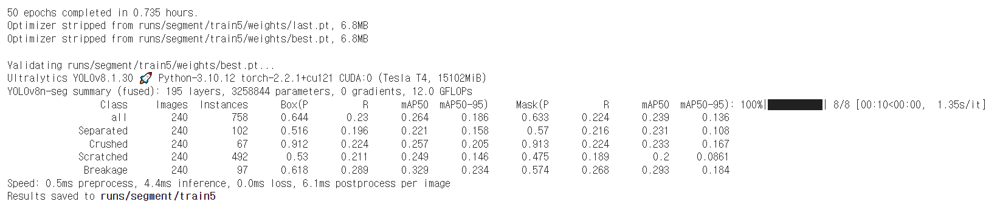
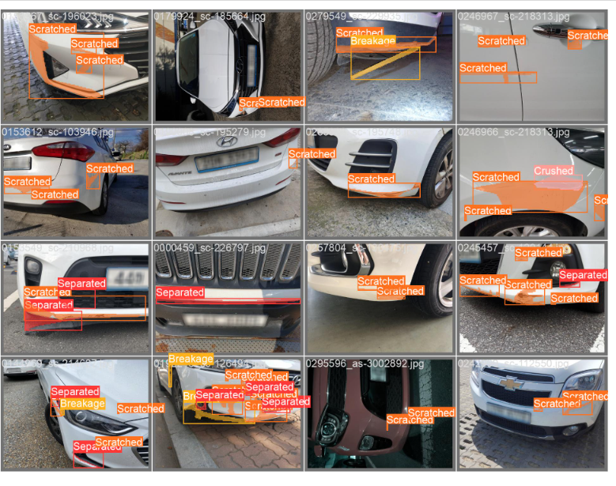

# Using YOLOv8 with Custom Data

분류: ML/DL
날짜: 2024년 3월 23일
설명: 커스텀 데이터로 YOLOv8 활용하기

# ✅ 실습 배경

### ✔우리Fisa 우리팀의 파이널 프로젝트 주제가 중고차 플랫폼으로 좁혀지는 가운데, 명색이 AI engineering 과정이기 때문에 AI 활용 서비스를 적극 도입하기로 했다.

### ✔데이터를 물색하던 중 AI hub에서 제공하는 차량 파손 데이터를 발견했고 얼핏 보기에도 데이터의 질과 양이 나쁘지 않아 보여 차량 파손 부위를 segmentation하는 YOLOv8 모델을 학습해보기로 했다.

### ✔마지막으로 사용해봤던 YOLOv5은 ultralytics의 github repository를 clone해서 사용해야 했어서 처음 사용할 땐 어려움이 컸었다.

### ✔그런데 어느 버전부터인지는 모르겠으나 ultralytics 파이썬 라이브러리로 코드 단 세 줄이면 모델 학습이 가능해졌다.

# ✅ Data pre-processing

### ✔ 데이터는 샘플 데이터를 사용했고 1200개의 차량 파손 이미지다.

### ✔ YOLOv8은 각각 아래와 같은 라벨링 데이터를 요구한다.

- Object Detection
    
    <aside>
    💡 <기본 형식>
    Class x중심좌표 y중심좌표 너비 높이
    
    </aside>
    
    <aside>
    💡 <데이터 예시>
    
    #0번 클래스의 (`0.5015625`, `0.5270833333333333`)를 중심으로 하는 너비 `0.996875`, 높이 `0.05416666666666667` 만큼의 박스
    
    `0 0.5015625 0.5270833333333333 0.996875 0.05416666666666667`
    
    </aside>
    
- Semantic Segmentation
    
    <aside>
    💡 <기본 형식>
    Class X1 X2 X3 Xn … Y1 Y2 Y3 … Yn
    
    </aside>
    
    <aside>
    💡 <데이터 예시>
    # 해당 데이터는 총 14각형으로 segmentation 구역이 라벨링 되어 있다.
    `0 0.003125 0.5 0.35625 0.5194444444444445 0.5708333333333333 0.5263888888888889 0.7770833333333333 0.5208333333333334 1.0 0.5041666666666667 0.9854166666666667 0.5236111111111111 0.9010416666666666 0.5375 0.7645833333333333 0.55 0.7395833333333334 0.55 0.5 0.5541666666666667 0.23541666666666666 0.55 0.06041666666666667 0.5263888888888889 0.005208333333333333 0.5194444444444445 0.003125 0.5`
    
    </aside>
    

### ✔하지만 AI hub에서 제공하는 데이터는 다목적으로 라벨링 되어 있다.

- **AI hub 라벨링 데이터(json) 중 하나**
    
    ```json
    {
      "info": {
        "name": "socar",
        "date_created": "03/08/2022"
      },
      "images": {
        "id": 1,
        "width": 960,
        "height": 720,
        "file_name": "0000459_sc-226797.jpg"
      },
      "annotations": [
        {
          "id": 2,
          "image_id": 1,
          "category_id": "sc-226797",
          "segmentation": [
            [
              [3,360],[342,374],[548,379],[746,375],[960,363],[946,377],[865,387],
              [734,396],[710,396],[480,399],[226,396],[58,379],[5,374],[3,360]
            ]
          ],
          "area": 19507.0,
          "bbox": [
            3,
            360,
            957,
            39
          ],
          "damage": "Separated",
          "part": null,
          "year": 2018,
          "color": "White",
          "level": null,
          "repair": []
        }
      ],
      "categories": {
        "id": "sc-226797",
        "supercategory_name": "Full-size car"
      }
    }
    ```
    
    ### ‘Annotation’ Key 아래에 ‘Segmentation’으로 세그먼트 구역을, ‘bbox’로 탐지 구역을, ‘damage’로 파손 종류를 지정해두었다.
    
    ### 때문에 위와 같은 YOLOv8 학습 목적으로 라벨링 데이터를 변경해야 한다.
    

### 💾몇 가지 함수로 YOLOv8 라벨링 데이터 생성하기

- Object Detection용 Label
    
    ```python
    import json
    import os
    
    def convert_polygon_to_yolo(bbox, image_width, image_height):
        # bbox가 좌표의 리스트인지 확인
        if len(bbox) == 0:
            return None
        
        # 가장 안쪽의 리스트를 추출합니다.
        bbox = bbox[0]
        
        # bbox의 x 좌표와 y 좌표를 추출합니다.
        x_coords = [point[0] for point in bbox]
        y_coords = [point[1] for point in bbox]
        
        x_min = min(x_coords)
        y_min = min(y_coords)
        x_max = max(x_coords)
        y_max = max(y_coords)
    
        # bbox의 너비와 높이를 계산합니다.
        bbox_width = x_max - x_min
        bbox_height = y_max - y_min
    
        # bbox의 중심점 좌표를 계산합니다.
        bbox_x = x_min + bbox_width / 2
        bbox_y = y_min + bbox_height / 2
    
        # YOLO 형식의 좌표로 변환합니다.
        yolo_x = bbox_x / image_width
        yolo_y = bbox_y / image_height
        yolo_width = bbox_width / image_width
        yolo_height = bbox_height / image_height
    
        return yolo_x, yolo_y, yolo_width, yolo_height
    
    def convert_json_to_yolo(input_folder, output_folder):
        # 입력 폴더에서 모든 JSON 파일을 가져옴
        json_files = [f for f in os.listdir(input_folder) if f.endswith('.json')]
    
        # 출력 폴더가 없으면 생성
        if not os.path.exists(output_folder):
            os.makedirs(output_folder)
    
        for json_file in json_files:
            # JSON 파일 경로
            json_path = os.path.join(input_folder, json_file)
    
            # JSON 파일 열기
            with open(json_path, 'r') as f:
                data = json.load(f)
    
            # 이미지의 너비와 높이 가져오기
            image_width = data['images']['width']
            image_height = data['images']['height']
    
            # YOLO 형식으로 변환된 좌표를 저장할 텍스트 파일 경로
            txt_file = os.path.join(output_folder, os.path.splitext(json_file)[0] + '.txt')
    
            # YOLO 형식으로 변환된 좌표를 텍스트 파일에 저장
            with open(txt_file, 'w') as f:
                for annotation in data['annotations']:
                    bbox = annotation['segmentation'][0]
                    yolo_x, yolo_y, yolo_width, yolo_height = convert_polygon_to_yolo(bbox, image_width, image_height)
                    
                    # 레이블을 숫자로 매핑
                    label_mapping = {
                        'Separated': 0,
                        'Crushed': 1,
                        'Scratched': 2,
                        'Breakage': 3
                    }
                    
                    # 레이블을 숫자로 변환하여 텍스트 파일에 저장
                    label = label_mapping.get(annotation['damage'], -1)
                    if label != -1:
                        f.write(f"{label} {yolo_x} {yolo_y} {yolo_width} {yolo_height}\n")
    
    # 사용 예시
    input_folder = "data/old_labels"  # 입력 폴더 경로
    output_folder = "data/labels"  # 출력 폴더 경로
    
    convert_json_to_yolo(input_folder, output_folder)                   
    ```
    
- Semantic Segmentation용 Label
    
    ```python
    import os
    import json
    
    # 좌표값을 모든 사이즈의 이미지에서 동일하게 적용되도록 0과 1 사이의 정규화 값으로 변환
    def normalize_coordinates(coordinates, width, height):
        normalized_coordinates = []
        for sublist in coordinates:
            for point in sublist:
                x = point[0] / width
                y = point[1] / height
                normalized_coordinates.extend([x, y])
        return normalized_coordinates
    
    # 각 클래스와 좌표를 매핑하는 함수
    def convert_coordinates(annotation, width, height):
        damage_mapping = {"Separated": 0, "Crushed": 1, "Scratched": 2, "Breakage": 3}
        damage_class = damage_mapping.get(annotation["damage"], -1)
        if damage_class == -1:
            return None
        
        segmentation = annotation["segmentation"][0]  # Assuming only one polygon per annotation
        normalized_segmentation = normalize_coordinates(segmentation, width, height)
        coordinates = ' '.join(map(str, normalized_segmentation))
        return f"{damage_class} {coordinates}"
    
    # json 파일에서 각 Key값을 불러오고 txt 파일로 변환하는 함수
    def convert_json_to_txt(json_file, output_folder):
        with open(json_file, 'r') as f:
            data = json.load(f)
        
        annotations = data["annotations"]
        image_width = data["images"]["width"]
        image_height = data["images"]["height"]
        file_name = data["images"]["file_name"].split('.')[0]
        txt_data = []
    
        for annotation in annotations:
            converted_annotation = convert_coordinates(annotation, image_width, image_height)
            if converted_annotation:
                txt_data.append(converted_annotation)
    
        txt_file = os.path.join(output_folder, f"{file_name}.txt")
        with open(txt_file, 'w') as f:
            for line in txt_data:
                f.write(line + '\n')
        
        print(f"Converted JSON to TXT: {txt_file}")
    
    # 폴더 내의 모든 json 파일에 대해 위 작업을 적용하는 함수
    def convert_all_json_to_txt(input_folder, output_folder):
        for file_name in os.listdir(input_folder):
            if file_name.endswith('.json'):
                json_file = os.path.join(input_folder, file_name)
                convert_json_to_txt(json_file, output_folder)
    
    # Usage example
    input_folder = "data\\old_labels"
    output_folder = "data\\new_labels"
    convert_all_json_to_txt(input_folder, output_folder)
    
    ```
    

```
# 함수가 정상 실행되면 아래와 같이 image 파일의 경로 리스트가 담긴 txt 파일을 얻는다.
/content/drive/MyDrive/yolov8_seg/yolo_seg/data/images/0106715_as-3022393.jpg
/content/drive/MyDrive/yolov8_seg/yolo_seg/data/images/0132489_sc-165095.jpg
/content/drive/MyDrive/yolov8_seg/yolo_seg/data/images/0236550_as-2596435.jpg
/content/drive/MyDrive/yolov8_seg/yolo_seg/data/images/0448400_sc-173570.jpg
/content/drive/MyDrive/yolov8_seg/yolo_seg/data/images/0254079_sc-208135.jpg
/content/drive/MyDrive/yolov8_seg/yolo_seg/data/images/0455362_sc-207823.jpg
/content/drive/MyDrive/yolov8_seg/yolo_seg/data/images/0044168_sc-133297.jpg
/content/drive/MyDrive/yolov8_seg/yolo_seg/data/images/0276496_as-0100133.jpg
/content/drive/MyDrive/yolov8_seg/yolo_seg/data/images/0209337_as-2599923.jpg
/content/drive/MyDrive/yolov8_seg/yolo_seg/data/images/0249040_sc-211483.jpg
/content/drive/MyDrive/yolov8_seg/yolo_seg/data/images/0085529_sc-109377.jpg
(생략...)
```

<aside>
💡 **<주의사항>**
- image의 파일명과 레이블 데이터의 파일명은 같아야 하며, 각각 data/images, data/labels 경로 아래에 저장한다.
- 윈도우 환경 vs code 등에서 실습하고자 할 때는 경로를 ‘\\’로 통일하고, 
리눅스 환경을 기반으로 하는 Colab 등의 환경에서는 ‘/’로 통일해야 오류가 발생하지 않는다.

</aside>

# ✅ 학습 준비

### YOLOv8 학습을 위해서는 사용할 data의 파일명 목록을 담은 txt 파일과
해당 txt 파일의 경로, 클래스 종류를 담은 yaml 파일을 필요로 한다.

```yaml
# data.yaml
names:
- Separated
- Crushed
- Scratched
- Breakage
nc: 4
train: data\train.txt
val: data\val.txt
```

### Train set과 Validation set을 나누기 위해 아래와 같은 코드를 사용한다

1. **glob으로 image 파일들의 파일명 불러오고 리스트로 만들기**
    
    ```python
    from glob import glob
    
    img_list = glob('data/images/*.jpg')
    ```
    
2. scikit-learn의 train_test_split 함수를 사용해 고르게 데이터를 나눈다
    
    ```python
    from sklearn.model_selection import train_test_split
    
    train_img_list, val_img_list = train_test_split(img_list, test_size=0.2, random_state=2000)
    ```
    
3. 만들어진 이미지 데이터 리스트를 txt 파일로 저장한다.
    
    ```python
    with open('/content/dataset/train.txt', 'w') as f:
      f.write('\n'.join(train_img_list) + '\n')
    
    with open('/content/dataset/val.txt', 'w') as f:
      f.write('\n'.join(val_img_list) + '\n')
    ```
    
4. 해당 txt 파일을 YOLOv8 모델이 읽어 학습할 수 있도록 경로를 지정해놓은 yaml 파일을 생성한다
    
    ```python
    import yaml
    
    with open('data/data.yaml', 'r') as f:
      data = yaml.load(f)
    
    print(data)
    
    data['train'] = 'data/train.txt'
    data['val'] = 'data/val.txt'
    
    with open('data/data.yaml', 'w') as f:
      yaml.dump(data, f)
    ```
    

### 위 코드를 이상없이 실행하면 아래와 같은 yaml 파일을 얻을 수 있다.

```yaml
# data.yaml
names:
- Separated
- Crushed
- Scratched
- Breakage
nc: 4
train: data/train.txt
val: data/val.txt
```

# ✅ 학습하기

### 데이터의 모든 준비는 끝났고, 이제 학습만 시키면 된다.

### 개요에서도 이야기했지만, ultralytics 라이브러리로 학습용 함수, 데이터 변환용 함수 등을 모두 제공하기 때문에 학습이 편리해졌다.

1. **먼저 ultralytics 라이브러리를 설치한다.**
    
    ```bash
    $ pip install ultralytics
    ```
    
2. **데이터 확인 및 추가 전처리
데이터 리스트 txt 파일에서 슬래시와 백슬래시가 혼용돼있을 경우 바꾸는 함수**
    
    ```python
    # 텍스트 파일을 읽어서 모든 백슬래시를 슬래시로 바꾸는 Python 코드
    
    input_file_path = "/content/drive/MyDrive/yolov8_seg/yolo_seg/data/val.txt"  # 입력 파일 경로
    output_file_path = "/content/drive/MyDrive/yolov8_seg/yolo_seg/data/val2.txt"  # 출력 파일 경로
    
    # 입력 파일 열기
    with open(input_file_path, "r") as input_file:
        # 입력 파일 내용 읽기
        file_content = input_file.read()
    
    # 백슬래시를 슬래시로 바꾸기
    file_content = file_content.replace("\\", "/")
    
    # 출력 파일에 쓰기
    with open(output_file_path, "w") as output_file:
        output_file.write(file_content)
    
    print("작업 끝")
    ```
    
3. **학습 시작**
    
    <aside>
    💡 **YOLO 모델 종류**
    YOLO 모델은 모델의 사이즈에 따라 5단계로 나뉘어있다.
    사이즈는 n → s → m → l → x 순으로 커진다.
    YOLO(’yolov8s-seg.pt’)의 s를 다른 사이즈로 바꾸면 자동으로 사전 학습 모델을 불러온다. 뒤의 seg를 빼면 단순 object detection 모델로 학습을 수행한다.
    
    </aside>
    
    ```python
    from ultralytics import YOLO
    
    model = YOLO('yolov8s-seg.pt')
    # results = model.train(data='{data.yaml 파일 경로}', epochs={에포크 횟수}, imgsz={이미지 축소/확대할 사이즈})
    results = model.train(data='data/data.yaml', epochs=50, imgsz=1200)
    ```
    

# ✅ 학습 결과

### 성능 지표



클래스별 평균 재현율이 0.64 정도로 학습됐다.

원본 데이터



검증 결과

.png)